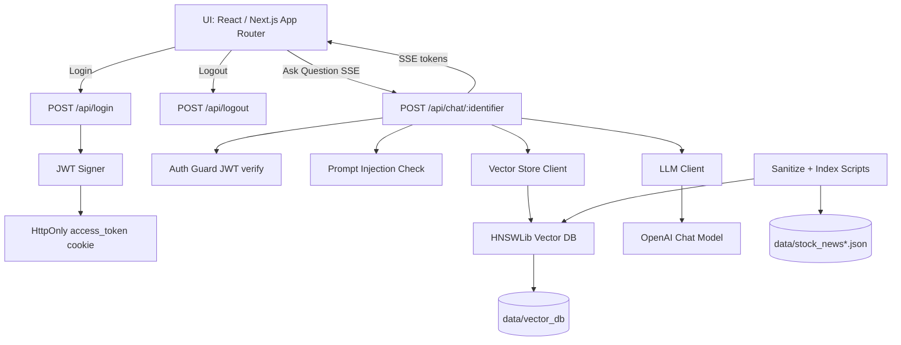

## Overview

This is a small chat application that answers questions about recent financial news using a local vector database built from `data/stock_news.json`.
It uses LangChain + OpenAI for embeddings and response generation, and streams responses to the UI.

### Technologies

- NextJS, TailwindCSS, React
- LangChainJS for LLM integration
- LocalStorage for mimicking backend db
- JWT for auth
- HNSWLib for file system based vector db
- Vitest for test coverage

### Ingestion

For this MVP, data vectorization is done locally and persisted to the filesystem.
Scripts are provided to sanitize data and build embeddings on demand.

## Key Features

- Accept username and password for login.
- On successful login, issue `access_token` (HttpOnly cookie) and `chat_identifier`.
- Use chat session identifier in the query string. If identifier is missing then show login, otherwise show chat.
- Chat component:
  - Text area for typing a question and send button
  - Show conversation history on top of the input field.
  - show loading state when waiting on the response from the backend.
  - stream response chunk back from api to frontend.
- API
  - GET /healthcheck - check if api is running
  - POST /login - authenticate
  - POST /logout - clear access token
  - POST /chat/{identifier} - post a question to backend and get response
- Data
  - vector_db (HNSWLib) - data indexes
  - stock_news.json - original data
  - stock_news_sanitized.json - sanitized data
- Lib
  - index_docs - generate embeddings
  - auth - jwt and validate required auth
  - llms - adapters for integration with llms, client give access to llm.
  - vector_store - adapters for integrating with hnsw, client provide access to implemented vector db.
  - security - prompt injection validation
- Tests
  - Vitest coverage for core lib utilities

### Non-Functional Notes

- Use LocalStorage for conversation history persistence (mimics a database).
- Protected routes validate the JWT from the `access_token` cookie.
- Environment variables are loaded from `.env`.

## Getting Started

This is a [Next.js](https://nextjs.org) project bootstrapped with [`create-next-app`](https://nextjs.org/docs/app/api-reference/cli/create-next-app).

### 1) Configure environment

Create `.env` using `.env.example` as a template.

> [!TIP]
> `USER_NAME` and `PASSWORD` values are used for login.
> `JWT_SECRET` is required for signing tokens.
> `OPENAI_API_KEY` is required for embeddings + chat.

### 2) Install dependencies

```bash
npm install
```

### 3) Run the dev server

```bash
npm run dev
```

Open [http://localhost:3000](http://localhost:3000) with your browser to see the result.

### 4) Data sanitization and ingestion

The sanitizer removes unicode artifacts, paywall snippets, and promotional/CTA text before embedding.

Sanitize content:
```bash
npm run sanitize:data
```

Generate embeddings (writes to `data/vector_db`):
```bash
npm run build:index
```

### Tests

```bash
npm run test
```

### Project Structure (Quick Map)

- `app/` - Next.js routes and API handlers
- `components/` - UI components
- `data/` - Raw data, sanitized data, and vector DB
- `lib/`
  - `auth/` - JWT helpers + auth guard
  - `llm/` - LLM adapter + client
  - `security/` - prompt injection checks
  - `vector_store/` - vector DB adapter + client
- `scripts/` - data sanitization script
- `tests/` - Vitest tests

### Architecture (Mermaid)


